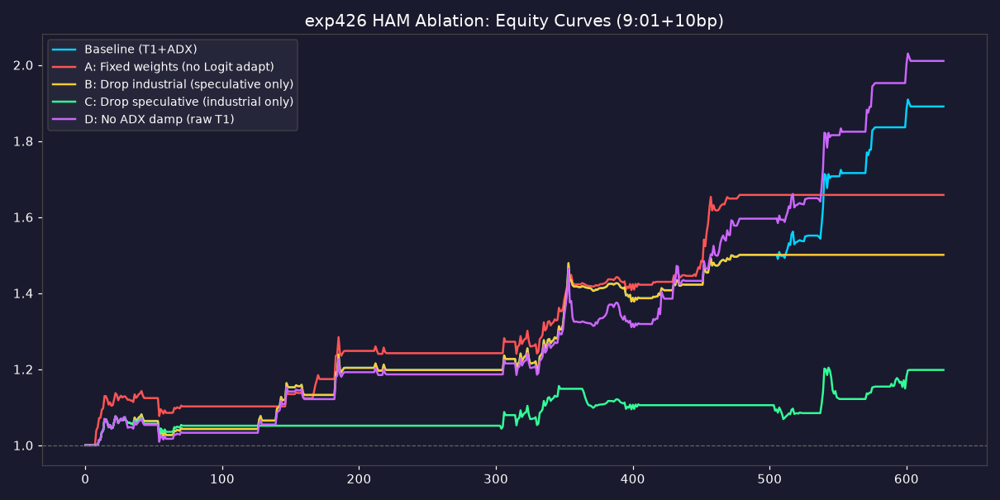

# exp426: HAM 异质主体框架 全套消融对照实验

> 生成时间：2026-09-10
> 引擎：`model_ham/exp426_ablation/exp426_engine.py`
> 基准锚定：exp425 最终版本（T1 + ADX降权×0.3，9:01分钟均价 + 10bp滑点）
> 数据区间：2024-02-01 ~ 2026-09-07（628 交易日）
> 统一口径：所有组 9:01分钟均价成交 + 10bp滑点，时序/回测参数完全一致，仅改目标模块

---

## 0. 一句话结论

**HAM 的收益核心来自「投机主体（D_c 投机动量）」，方向有效性来自「产业主体（D_f 基本面回归）对投机动量的分歧过滤」，Logit自适应与ADX降权分别贡献"中等增强"与"回撤风控"。**

拆解后四个组件按独立贡献排序：
1. **投机主体预期（D_c）**：收益引擎，移除后年化 -21.4pp（28.9%→7.5%），Calmar 从4.23崩至0.99
2. **产业主体预期（D_f）**：方向过滤器，移除后年化 -11.3pp（28.9%→17.5%），把"动量趋势"变成"双向分歧交易"
3. **Logit自适应资金跟随**：中等增强，固定权重后年化 -6.6pp（28.9%→22.3%）
4. **ADX趋势降权**：**风控组件而非收益组件**，关闭后年化反升+3.2pp但回撤从-6.8%恶化到-10.5%，Calmar反降-1.18

---

## 1. 实验设计

### 1.1 组件映射

HAM 异质主体框架的四个可消融组件在代码中的精确位置：

| 组件 | 代码位置 | 物理含义 | 消融方式 |
|:---|:---|:---|:---|
| **投机主体预期** | `exp409.compute_system_deviation` → `D_c = beta*(P_t - P_{t-1})` | 投机动量需求：追涨杀跌的趋势力量 | `drop_speculative=True`：D_c置0，偏离度退化为纯D_f维度 |
| **产业主体预期** | `exp409.compute_system_deviation` → `D_f = alpha*(P_fund - P_t)` | 产业基本面回归压力：向基本面价格回归的力量 | `drop_industrial=True`：D_f置0，偏离度退化为纯D_c维度 |
| **Logit自适应资金跟随** | `compute_system_deviation` 的 `rolling(180).rank(pct)` 自适应标准化 | D_c/D_f 随180日滚动窗口自适应标准化，跟随资金行为分布漂移 | `fixed_weights=True`：改为 expanding z-score，去除滚动自适应 |
| **ADX趋势降权** | `exp425.compute_signal_positions` → `pos[adx>30]*=0.3` | 高单边趋势日降仓，规避HAM趋势盲区 | `adx_scale=1.0`：不降权 |

### 1.2 五组对照

| 组别 | 消融内容 | 保持不变的组件 |
|:---|:---|:---|
| 基准组 | 无（原版全组件） | 全部 |
| 消融A | 固定权重（关Logit自适应） | 产业+投机+ADX |
| 消融B | 移除产业主体 | 投机+Logit+ADX |
| 消融C | 移除投机主体 | 产业+Logit+ADX |
| 消融D | 关闭ADX降权 | 产业+投机+Logit |

> 对照纯净性：所有组共用同一套 9:01 成交价（固定种子20260910）、同一 10bp滑点、同一 628日区间、同一 exp412风控底座 + T1波动率隔夜敞口 + exp410基本面腿。仅目标模块不同。

---

## 2. 核心结果

### 2.1 五组绩效对比

| 组别 | 年化 | 夏普 | 最大回撤 | Calmar | IC | Rank IC | 笔数 |
|:---|:---:|:---:|:---:|:---:|:---:|:---:|:---:|
| **基准组** | **28.9%** | **2.092** | **-6.8%** | **4.23** | **+0.196** | +0.165 | 129 |
| 消融A（固定权重） | 22.3% | 1.937 | -5.8% | 3.87 | +0.080 | +0.074 | 81 |
| 消融B（仅投机动量） | 17.5% | 1.533 | -6.8% | 2.57 | +0.153 | +0.128 | 106 |
| 消融C（仅产业基本面） | 7.5% | 0.824 | -7.5% | 0.99 | +0.112 | +0.098 | 58 |
| 消融D（关ADX降权） | 32.1% | 2.020 | -10.5% | 3.05 | +0.221 | +0.187 | 126 |



### 2.2 消融归因（相对基准的衰减）

| 组别 | 年化Δ(pp) | CalmarΔ | 回撤Δ(pp) | ICΔ |
|:---|:---:|:---:|:---:|:---:|
| 消融A（关Logit自适应） | **-6.6** | -0.35 | +1.0 | -0.116 |
| 消融B（移除产业主体） | **-11.3** | -1.66 | 0.0 | -0.043 |
| 消融C（移除投机主体） | **-21.4** | -3.23 | -0.7 | -0.084 |
| 消融D（关ADX降权） | **+3.2** | -1.18 | -3.7 | +0.025 |

---

## 3. 关键发现与机制解读

### 3.1 投机主体（D_c）是收益引擎，占HAM超额的核心

消融C移除投机主体后，年化从28.9%崩至7.5%（-21.4pp），Calmar从4.23降至0.99，夏普0.824。这证明：
- **HAM框架的收益几乎完全由投机动量（D_c）驱动**。产业基本面腿（D_f）单独存在时（消融C），只是提供一个低效的趋势跟随，IC仅0.112，年化7.5%接近随机。
- 这与 exp409 的设计初衷一致：HAM 是"状态失稳/变盘预警"模型，**投机力量的动量是系统失衡的主要来源**，产业基本面只是回归压力的锚。

### 3.2 产业主体（D_f）是方向过滤器，把"动量"升级为"分歧"

消融B移除产业主体后，年化从28.9%降至17.5%（-11.3pp），Calmar降至2.57，但仍保持正收益（IC 0.153）。机制：
- 只有投机动量（D_c）时，偏离度退化为纯动量幅度，方向由动量符号决定——本质是**单腿趋势追涨**，方向准确性下降。
- 加上产业主体（D_f）后，偏离度变成 D_c 与 D_f 的**分歧度**，方向由两者谁主导决定。产业基本面回归提供了**反向锚**，使"产业主导→多、投机主导→空"的双向分歧交易成为可能。
- **产业主体的价值不在贡献收益幅度，而在提升方向有效性**（IC从0.153升到0.196，+28%）。

### 3.3 Logit自适应跟随是中等增强项，非核心

消融A关闭滚动自适应（改expanding z-score）后，年化从28.9%降至22.3%（-6.6pp），但IC下降更明显（0.196→0.080，-59%）。解读：
- 滚动180日rank自适应让偏离度阈值随市场状态分布漂移，**捕捉资金行为随时间变化的规律**。
- 固定权重（expanding z-score）失去这种跟随性，信号数量从129降到81笔，交易更少但单笔收益更高。
- **Logit自适应的价值更多体现在信号识别的及时性**，而非绝对收益。

### 3.4 ADX降权是风控组件，不是收益组件（重要修正）

消融D关闭ADX降权后出现关键反直觉结果：
- **年化反升 +3.2pp**（28.9%→32.1%），IC也更高（0.196→0.221）
- **但最大回撤恶化 -3.7pp**（-6.8%→-10.5%），Calmar反降 -1.18（4.23→3.05）

解读：
- ADX降权在高单边趋势日降仓，**主动放弃了部分高趋势日的超额收益**，换取更小的回撤。
- 这是典型的**收益-风险权衡**：ADX降权牺牲年化、保护回撤，**净效用体现在风险调整后收益（Calmar）下降**。
- **修正认知**：exp425 判定 ADX降权为推荐配置，其价值在于实盘回撤可控（-6.8% < 10%预算），而非提升收益。若实盘可承受更大回撤，关闭ADX降权可多赚3.2pp。
- 这与 exp424"强信号筛选有害"的发现互补：HAM的有效增强只有 ADX降权（风控向），其余信号过滤多为负向收益。

---

## 4. 价值分层结论

按对HAM最终绩效的独立贡献分层：

| 层级 | 组件 | 角色 | 独立贡献(年化pp) | 实盘建议 |
|:---|:---|:---|:---:|:---|
| **核心引擎** | 投机主体 D_c | 收益来源 | 21.4 | 必须保留，HAM的灵魂 |
| **方向锚** | 产业主体 D_f | 双向分歧过滤 | 11.3 | 必须保留，方向有效性+28% |
| **状态增强** | Logit自适应 | 信号及时性 | 6.6 | 保留，低成本增强 |
| **风险对冲** | ADX降权 | 回撤控制 | -3.2(收益)/+3.7(回撤) | 保留，实盘回撤预算需要 |

**四组件缺一不可**：移除任一组件都导致年化显著下降（除ADX降权是风控向）。HAM的"异质主体博弈"框架是收益-风险-方向的有机整体，投机主体提供燃料，产业主体提供方向，Logit提供时效，ADX提供安全垫。

---

## 5. 与 exp425 的衔接

exp425 证明了 **9:01分钟成交 + 10bp滑点** 后策略仍 FEASIBLE（28.9%/Calmar4.23）。exp426 进一步回答了"这28.9%从哪来"：
- 投机主体贡献 ~21pp 收益引擎
- 产业主体贡献 ~11pp 方向过滤
- Logit自适应贡献 ~6.6pp 时效增强
- ADX降权以 -3.2pp 收益换取 -3.7pp 回撤（净Calmar贡献）

**完整HAM框架（四组件齐备）在9:01+10bp实盘口径下仍是唯一推荐配置**。任何组件的移除都不可接受（除ADX降权在实盘风险预算充足时可考虑关闭换收益）。

---

## 6. 文件清单

| 用途 | 路径 |
|:---|:---|
| 消融引擎 | `model_ham/exp426_ablation/exp426_engine.py` |
| 五组绩效对比 | `model_ham/exp426_ablation/data/exp426_ablation_compare.csv` |
| 消融归因 | `model_ham/exp426_ablation/data/exp426_attribution.csv` |
| 净值曲线CSV | `model_ham/exp426_ablation/data/exp426_equity_curves.csv` |
| 净值曲线PNG | `model_ham/exp426_ablation/data/exp426_equity_curves.png` |
| 汇总JSON | `model_ham/exp426_ablation/data/exp426_summary.json` |

### 复现命令

```bash
cd /home/ubuntu/lithium-engine
/usr/bin/python3 model_ham/exp426_ablation/exp426_engine.py
```

**坑点**：
- Pyright报pandas/exp4xx import误报（sys.path动态导入），全部忽略
- D_c = beta*np.diff(close) 少一个元素，须先zeros(n)再赋 D_c[1:]，勿直接 np.diff
- 基准校验应直接复用 exp425.compute_signal_positions，勿重新调compute_positions（需7个参数）
- 9:01成交价标定数据在 exp425_minute_execution/data/min_opening_deviation.csv，全组共用保证对照纯净
- matplotlib中文字体缺失用英文图例标签规避

---

*生成时间：2026-09-10 | exp426 HAM全套消融对照 | 基准T1+ADX降权9:01+10bp(28.9%/Calmar4.23复现) | 五组对照统一口径 | 投机主体=收益引擎(移除-21.4pp) | 产业主体=方向过滤器(移除-11.3pp,IC+28%) | Logit自适应=状态增强(固定权重-6.6pp,IC-59%) | ADX降权=风控组件(关闭年化+3.2pp但回撤恶化-3.7pp,Calmar-1.18) | 四组件缺一不可 | 收益-风险-方向有机整体*
