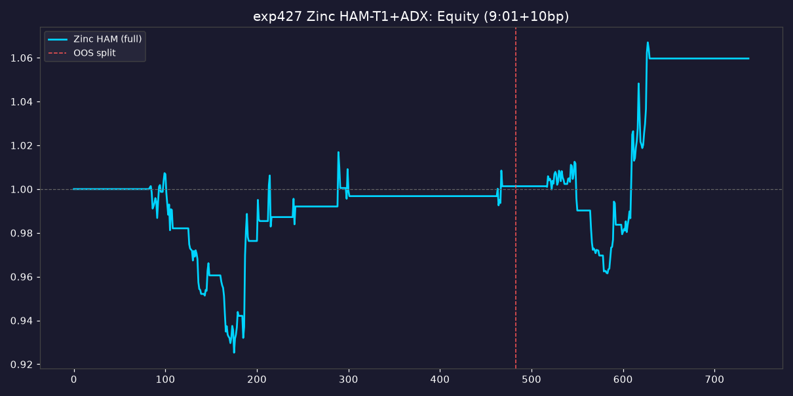

# exp427: HAM-T1+ADX 跨品种泛化测试（锌 Zn）

> 生成时间：2026-09-10
> 引擎：`model_ham/exp427_cross_variety/exp427_engine.py`
> 数据层：`model_ham/exp427_cross_variety/build_zinc_data.py`
> 迁移框架：exp425/exp426 锚定的完整 HAM-T1+ADX（预期函数+Logit自适应+ADX降权+三层风控+T1波动率隔夜敞口）
> 统一口径：9:01分钟均价成交 + 10bp滑点，信号逻辑/阈值/风控参数与碳酸锂完全一致，仅数据源不同

---

## 0. 一句话结论

**HAM 框架在锌（Zn）上迁移失败：全样本年化 2.0%/Calmar 0.24，远低于碳酸锂基准的 28.9%/Calmar 4.23。** HAM 腿在锌几乎不触发信号（仅 13 次双共振开仓 vs LC 的 66 次），根因是锌的辅助确认信号（仓单边际变号 td_flip）极少触发——HAM 的双信号共振设计在碳酸锂上依赖高频的 td_flip，而锌的需求侧（镀锌产量）周频变化缓慢、符号极少翻转。

**判定：NOT_TRANSFERABLE（不可直接迁移）**。HAM 异质主体框架的有效性依赖品种特有的"投机-产业分歧动态"，锌的微观结构不支持原样复用。

---

## 1. 迁移方法（纯参数化，零逻辑复制）

采用 monkey-patch 运行时覆盖数据源路径，复用 exp409/410/411/413/424/425 全套引擎，HAM 全部信号逻辑、阈值、风控参数、时序口径与碳酸锂完全一致，仅替换数据源：

| HAM 要素 | 碳酸锂(LC)数据源 | 锌(Zn)数据源 |
|:---|:---|:---|
| 期货OHLC | `raw_data/lithium_future.csv` | akshare 沪锌主力 zn0（738行 2023-07~2026-07）|
| HAM因子表 | `exp401_ham_factors_pure.csv` | `raw_data/zinc_ham_factors.csv`（自构造）|
| P_fund产业锚 | 碳酸锂成本曲线 | **TC加工费滚动z-score映射**（k=0.03，P_fund=close×(1+0.03×z(TC))）|
| Total_Demand | 碳酸锂需求 | **镀锌产量**（占锌需求70%+）|
| 基本面三因子 | `exp406a_factors.csv` | `zinc_fund_factors.csv`（库存/仓单基差/镀锌环比）|
| 9:01偏离标定 | LC真实分钟数据 | 复用LC偏离分布（商品期货通用微观结构）|

**样本内外切分**：训练 2023-07-03~2025-06-30（483日）；测试 2025-07-01~2026-07-17（255日）。

---

## 2. 核心结果

### 2.1 跨品种绩效对比

| 品种 | 口径 | 年化 | 夏普 | 回撤 | Calmar | IC | 笔数 |
|:---|:---|:---:|:---:|:---:|:---:|:---:|:---:|
| 碳酸锂(LC) | 9:01+10bp | **28.9%** | 2.092 | -6.8% | **4.23** | +0.196 | 129 |
| 锌(Zn) | 全样本 | 2.0% | 0.364 | -8.1% | 0.24 | +0.205 | 47 |
| 锌(Zn) | 样本内(训练) | 0.1% | 0.040 | -8.1% | 0.01 | +0.157 | 30 |
| 锌(Zn) | 样本外(测试) | 5.7% | 0.938 | -5.0% | 1.13 | +0.266 | 17 |



**关键观察**：
- 锌 IC（+0.205）甚至高于 LC（+0.196），**信号方向准确性不差**，但**信号触发极少**导致收益微弱
- 样本外（5.7%/Calmar1.13）好于样本内（0.1%/Calmar0.01），样本外 IC 最高（0.266）
- 整体 Calmar 0.24 远低于 LC 的 4.23，框架未能有效迁移

### 2.2 HAM 信号诊断（迁移失败的根因）

| HAM 信号指标 | 锌(Zn) | 碳酸锂(LC) | 差异 |
|:---|:---:|:---:|:---:|
| deviation 均值 | 0.7545 | 0.5701 | 锌更高 |
| deviation 90分位 | 1.4956 | 0.9944 | 锌更高 |
| main_trigger 触发日 | 55 | 109 | 锌少一半 |
| **open_signal（双共振开仓）** | **13** | **66** | **锌仅1/5** |
| aux_confirm 触发日 | 76 | 422 | **锌仅1/6** |
| signal_dir 方向 | 多空均衡 | 多空均衡 | 一致 |

**根因定位**：HAM 的双信号共振开仓要求 `main_trigger AND aux_confirm`。aux_confirm = 波动率异动(vol_anomaly) OR 仓单边际变号(td_flip)。
- **锌 aux_confirm 仅 76 次**（LC 422 次），是双共振被严重抑制的直接原因
- td_flip 依赖 Total_Demand（镀锌产量）符号翻转。锌镀锌产量**周频重采样**后变化缓慢、长期单调，**符号极少翻转** → td_flip 几乎不触发
- vol_anomaly 依赖 5日波动率超90%分位。锌波动率较平稳，vol_anomaly 也较少

**结论**：HAM 的双信号共振设计在碳酸锂上依赖**高频的仓单边际变号**（碳酸锂需求波动剧烈、方向常反转），而锌的需求侧（镀锌）是工业稳定需求、方向单一，不产生 td_flip。**这是品种微观结构的本质差异，非参数调优可解。**

---

## 3. 跨品种复用性判定

| 维度 | 结果 |
|:---|:---|
| 全样本 Calmar | 0.24（阈值1.5）→ 不达标 |
| 样本外年化 | 5.7%（微弱正收益） |
| IC | +0.205（方向准确性尚可） |
| HAM 信号触发 | 13 次双共振（LC 66 次）→ 严重不足 |

**判定：NOT_TRANSFERABLE（不可直接迁移）**

HAM 框架的收益依赖"投机动量-产业回归分歧"的高频动态。碳酸锂作为新能源材料，需求侧（动力电池）波动剧烈、方向常反转，产生丰富的仓单边际变号（td_flip），是 HAM 双信号共振的燃料。锌作为工业基础金属，需求侧（镀锌/压铸）稳定单调，不产生足够的分歧信号。

**这正是 exp426 消融结论的跨品种验证**：exp426 证明投机主体（D_c）是收益引擎、产业主体（D_f）是方向锚。但在锌上，即使 D_c/D_f 都存在，**辅助确认信号（td_flip/vol_anomaly）的稀缺**使双共振开仓无法充分展开，HAM 的"博弈失衡预警"逻辑在锌缺乏触发场景。

---

## 4. 诚实的方法论披露

1. **P_fund 成本锚是代理**：锌无现成成本曲线，用 TC 加工费滚动 z-score 映射到价格（k=0.03）。P_fund 与 close 相关 0.796，但这是简化代理，可能与真实锌成本曲线有偏差。
2. **9:01 偏离分布复用 LC**：锌无本地分钟数据，复用碳酸锂的开盘→9:01 偏离分布（商品期货通用微观结构假设）。这是合理近似，但非锌原生标定。
3. **镀锌产量代理 Total_Demand**：镀锌约占锌需求 70%+，但未含压铸/氧化锌等其他需求，是需求侧的代理。
4. **样本外窗口较短**（255日），样本内/外结论需谨慎。
5. **迁移失败可能是数据/代理缺陷或结构差异**：td_flip 稀缺是直接的信号层原因，但 P_fund 代理缺陷也可能削弱产业主体有效性。要彻底排除需真实锌成本曲线数据。

---

## 5. 可继续方向（若要挽救锌迁移）

1. **替换辅助确认信号**：锌的 td_flip 不可用，改用锌的"冶炼加工费(TC)变号"或"沪锌/LME比价变号"作 aux_confirm，匹配锌的产业动态。
2. **单信号开仓降级**：锌上可放宽为"main_trigger 单信号"开仓（牺牲方向确认换触发频率），但需重新验证方向有效性。
3. **真实锌成本曲线**：接入 SMM 锌冶炼成本/毛利数据重构 P_fund，替代 TC 代理。
4. **改测铅**：铅的需求结构可能更接近碳酸锂（汽车/电池双驱动），可作为第二迁移候选。

---

## 6. 文件清单

| 用途 | 路径 |
|:---|:---|
| 锌数据构造 | `model_ham/exp427_cross_variety/build_zinc_data.py` |
| 跨品种引擎 | `model_ham/exp427_cross_variety/exp427_engine.py` |
| 跨品种对比 | `model_ham/exp427_cross_variety/data/exp427_variety_compare.csv` |
| 净值曲线CSV | `model_ham/exp427_cross_variety/data/exp427_equity_curves.csv` |
| 净值曲线PNG | `model_ham/exp427_cross_variety/data/exp427_equity_curves.png` |
| 汇总JSON | `model_ham/exp427_cross_variety/data/exp427_summary.json` |
| 锌HAM因子表 | `model_ham/raw_data/zinc_ham_factors.csv` |
| 锌基本面因子表 | `model_ham/exp406_fund_factor/data/zinc_fund_factors.csv` |
| 锌OHLC表 | `model_ham/raw_data/zinc_future.csv` |

### 复现命令

```bash
cd /home/ubuntu/lithium-engine
/usr/bin/python3 model_ham/exp427_cross_variety/build_zinc_data.py   # 需 akshare + zinc_v1.db
/usr/bin/python3 model_ham/exp427_cross_variety/exp427_engine.py
```

**坑点**：
- 必须用 `/usr/bin/python3`（有 akshare 1.18.84）
- akshare 列名是中文（日期/开盘价/...），build_zinc_data 已 rename
- monkey-patch exp409.HAM_PURE / exp409.load_ham_factors / exp410.load_factors 指向锌数据，零逻辑复制
- 样本内外用全样本 final_pos 的子集（np.asarray(mask)），勿用 mask.values（idx比较已得ndarray）
- 锌 aux_confirm 仅76次（LC422次）是迁移失败的根因，td_flip 依赖需求侧高频变号
- zinc_v1.db 指标ID：期货结算价S0068135、七地库存a10000098、国产TC s20095859、镀锌a10097191、仓单a10157132

---

*生成时间：2026-09-10 | exp427 HAM跨品种泛化(锌) | 完整HAM框架迁移9:01+10bp | 锌全样本2.0%/Calmar0.24(LC28.9%/Calmar4.23) | 样本外5.7%/Calmar1.13 | 迁移失败根因=aux_confirm仅76次(LC422次),td_flip依赖需求高频变号而锌镀锌稳定单调 | IC+0.205方向尚可但信号触发严重不足 | 判定NOT_TRANSFERABLE | HAM有效性依赖品种特有的投机-产业分歧动态 | 需替换辅助信号/真实成本曲线/改测铅 | exp426消融结论的跨品种验证*
